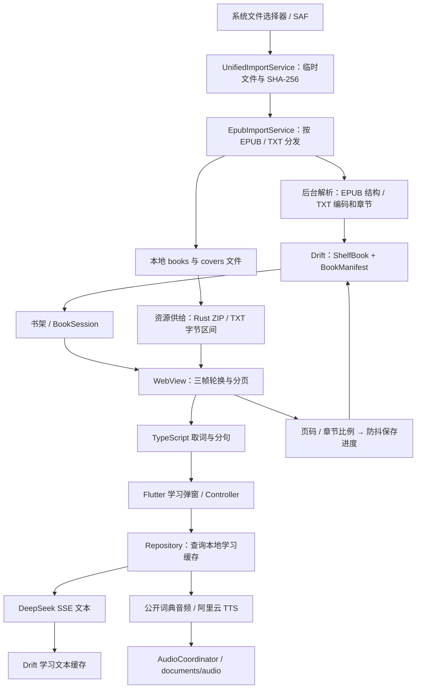

# 项目恢复开发审查（2026-09-05）

审查基线：`0a0c88c740111096dfff6ae91f01278c804ad9a8`，开始时工作区干净。范围包括 Dart、阅读器 TypeScript/CSS、Rust EPUB 后端、Android/iOS 接入、数据库、依赖锁文件、CI 与项目文档。功能规格为：中文母语者通过阅读英文图书学习英语；本地书架与进度；点击单词、长按句子学习；用户自填 DeepSeek/TTS 密钥；无自建业务服务端、无账号；MIT 开源。

**结论：现有技术路线足以继续开发，主链路已实现，但尚不适合直接作为稳定版本发布。优先修复学习请求生命周期、英文上下文提取和数据完整性，再增量调整阅读器分层。** Flutter 静态分析和既有测试全绿，不能覆盖这些跨层、跨运行时问题。

本报告是上述基线的审查快照，不替代 [技术债清单](TECH_DEBT.md) 的持续追踪；不修改生产实现，也不创建或发布 GitHub issue。

## 1. 验证证据与边界

| 检查 | 实际结果 |
|---|---|
| 工具链 | Flutter 3.44.9，Dart 3.12.2 |
| `flutter analyze` | 通过，无问题 |
| `flutter test --reporter expanded` | 17 个测试文件，140 项通过 |
| `dart format --output=none --set-exit-if-changed lib test` | 201 个文件，0 个需格式化 |
| 阅读器 `tsc --noEmit` | 使用 lockfile 安装的 TypeScript，在隔离目录执行，通过 |
| `cargo test --locked --manifest-path rust/Cargo.toml` | 编译通过，**0 项测试** |
| `flutter pub outdated --json` | 成功取得当前、可升级、可解析版本；返回的 81 条记录未标记停更、撤回或受公告影响 |
| 阅读器 npm 锁定依赖安装审计 | 0 个已报告漏洞；该依赖树仅包含 TypeScript 等极少量包 |
| 临时 Dart 缺陷探针 | 6 项通过，断言的是下文描述的错误行为仍存在，不代表缺陷已修复 |
| 临时 JavaScript 探针 | 转译并执行实际取词/分句方法，复现斜体节点截断、缩写拆词、小数误分句 |

未使用真实用户密钥或发起付费 AI/TTS 请求；未运行 Android/iOS 真机交互、发布构建或性能采样。网络服务可用性结论来自代码与官方文档，平台存储问题须用真机补证。未完成 Cargo/CocoaPods/Gradle 全量漏洞扫描、第三方素材授权核验或 Git 全历史密钥审计，不能把 pub/npm 结果解释为完整供应链安全证明。

临时证据保存在 `/tmp/synlen-audit-*.log`、`/tmp/synlen_audit_test.dart`、`/tmp/synlen_txt_audit_test.dart` 和 `/tmp/synlen-audit-web/repro.cjs`；这些文件可能被系统清理。下文保留触发输入与期望修复，便于转为仓库回归测试。

## 2. 实际架构与数据流

值得保留的设计：

- Flutter + WebView 复用 EPUB 排版能力；TXT 转为相同 XHTML 阅读输入，避免维护两个阅读器。
- `ShelfBook` 与 `BookManifest` 分开，书架无需加载整本书的 spine/TOC；SHA-256 用于导入去重。
- EPUB 保持压缩，Rust 按条目读取；资源缓存有 256 项、24 MiB 总量、2 MiB 单项上限；三帧轮换与相邻章节预载已有实现。
- 学习文本和音频状态分开，文本流约 100 ms 节流；词典优先、TTS 回退；缓存区分单词上下文及 TTS 音色。
- 用户密钥写入系统安全存储；没有发现账号登录、自建业务 API 或全书上传链路。更新检查另行访问 OSS。
- EPUB iframe 已使用 `sandbox="allow-same-origin"`，没有允许书内脚本执行；不能仅凭外层 WebView 开启 JavaScript 就断言书内脚本可任意执行。

架构债务仍集中在阅读器。排除生成物后，`lib/src` 有 148 个 Dart 文件、约 2.25 万行；reader 的 presentation 约 4,802 行、22 文件，application 只有 147 行的设置管理。导航、生命周期、进度、业务异常和学习弹窗编排大多留在 `ReaderScreen` 与 part mixin。

静态 import 统计得到 11 个 presentation 文件直接依赖 data，共 21 条 import；跨 feature 依赖涉及 17 个文件、31 条 import。它们不是 31 个独立用户缺陷，但说明当前规则尚未形成可执行边界。`core/database` 又依赖 library 的领域类型，基础设施与 feature 并未完全解耦。

## 3. 优先修复的问题

P1 表示影响核心功能、数据可靠性或发布就绪，应先于新功能修复；P2 表示应计划修复的功能/工程缺口。每项注明证据强度。

### F01 · P1 · DeepSeek 模型名已经超过官方停用日期

位置：`lib/src/features/learning/data/services/deep_seek_service.dart:15`。

代码固定请求 `deepseek-chat`。官方公告将该旧模型名的停止使用日期定为 **2026-07-24**，已早于本次审查日期；当前官方模型表列出 V4 系列。所有未命中文本缓存的单词和句子查询都依赖这个常量。证据为源码与官方兼容性公告，未用真实 Key 实测 HTTP 返回。[DeepSeek 官方更新日志](https://api-docs.deepseek.com/zh-cn/updates/)、[当前模型表](https://api-docs.deepseek.com/quick_start/pricing/)。

修复：选择当前受支持模型，显式配置适合词典响应的非思考模式、输出长度与超时；不要只替换模型名而依赖新模型默认行为。用脱敏 SSE 样本验证适配器，并进行一次受控端到端验收。

### F02 · P1 · 学习 Controller 没有维持 Repository/Service 的生命周期

位置：`learning/application/word_learning_controller.dart:58`、`sentence_learning_controller.dart:37`、`learning/data/repositories/learning_repository_provider.dart:27`（均在 `lib/src/features/` 下）。

Controller 仅 `ref.read` 默认 autoDispose 的 repository；repository 对 service 的监听随自身销毁而消失。service 内的密钥和音色闭包仍捕获其 provider 的 `ref`。数据库、文件或词典网络等待跨过销毁调度后，再读这些闭包会抛出 disposed Ref 错误；TTS 回退和音频落盘时尤其容易遇到。

已复现：读取 `deepSeekServiceProvider` 后执行 `container.pump()`，保留的 service 再调用解释流时得到包含 disposed 的 `LearningException.details`，尚未发出网络请求。

修复：由仍被弹窗监听的 Controller 明确持有依赖订阅，或建立请求作用域；关闭时释放。不要把所有 provider 改成永久存活来掩盖所有权问题。补“慢词典 → TTS 回退”“慢缓存读取”“关闭后回调”的完整 Controller 测试。

### F03 · P1 · 已保存的 Key 在首次查询时仍被判定为空

位置：`lib/src/features/settings/application/api_key_notifier.dart:18`，以及 F01 的 `_ensureConfigured()`。

`build()` 启动异步 `_load()`，立即返回空配置；service 同步检查这个空配置。未预先进入设置页的冷启动路径上，第一次触及 Key provider 就可能误报“未配置”；加载完成不会自动重试失败请求。读存储失败也没有独立错误状态。

已复现：mock 安全存储已有两个 Key，第一次解释流抛 `noDeepSeekApiKey`；随后配置成功加载。修复为可等待的配置加载状态，区分加载中、确实为空和读取失败；同时防止晚到的加载覆盖用户刚保存的值。

### F04 · P1 · 英文取词和整句上下文不完整

位置：`web_assets/controller.js/renderer/interaction.ts:374`、`:393`。

取词只识别 `\w`；分句只检查当前 `Text` 节点。`I <em>really</em> love this book.` 中点按或长按 `really`，上下文只有 `really`；`don’t` 会查成 `don` 或 `t`；`It costs 3.14 dollars.` 中长按 `dollars` 会得到 `14 dollars.`。这些行为已由实际方法的隔离执行确认，影响单词语境释义、句子翻译和整句朗读三条路径。

修复：以段落等语义块建立跨内联节点的文本与 DOM offset 映射，再进行英文分词/分句；覆盖缩写、弯引号、连字符、小数、引文结束符。补真实 DOM 测试及双端手势验收；还要验证空白处 caret 被吸附到附近文字时不会误弹查词。

### F05 · P1 · TXT 开头空行造成章节字节区间错位与末尾截断

位置：`lib/src/features/library/data/parsers/txt_chapter_splitter.dart:92`、`txt_book_parser.dart:84`。

切分器丢弃首标题前的纯空白区间，但归一化文件仍保留空白；解析器从字节偏移 0 开始累计各章节长度。复现输入为 `\n\nChapter 1\nFirst sentence.\nChapter 2\nFinal sentence.`，按生成范围拼回内容时末尾少两个字符，各章节边界也提前两字节。

修复：让章节范围连续覆盖实际保存文本，或严格按实际字符起止转换为 UTF-8 字节偏移。伴生测试须断言全部章节拼接还原完整原文，覆盖前导空白、CRLF、中文与非 BMP 字符；不要只断言章节数。

### F06 · P1 · 退出阅读没有可靠地提交最后进度

位置：`lib/src/features/reader/presentation/mixins/progress_mixin.dart:42`、`reader_screen.dart:273`、`lib/src/features/reader/data/book_session.dart:35`、`:143`。

进度经过 UI 1 秒防抖和 BookSession 10 ms 定时器。系统返回成功的 PopScope 分支没有保存；dispose 会取消两层定时器。工具栏返回虽然调用 `saveProgress()`，该方法本身仍只是排定 10 ms 后保存，不能当作已提交；快速销毁路径会取消它。已复现 `saveProgress → dispose` 后数据库保持旧进度。

修复：提供返回 Future 的最终提交操作，统一处理工具栏返回、系统返回和生命周期；合并防抖所有权，等待可等待的退出提交，并处理仓库的 `Either` 错误。另需确认字体/窗口改变后按章节比例恢复是否符合产品精度要求；比例不是稳定文字锚点。

### F07 · P1 · 恢复较新 BookManifest 会静默失败

位置：`lib/src/features/library/data/services/import_backup_service.dart:326`、`lib/src/features/library/data/book_manifest_repository.dart:24`。

备份反序列化的 manifest 使用 `id=0`；发现已有记录后仍原样保存。Drift 默认 upsert 冲突目标是主键，不能处理这次 `fileHash` 唯一约束冲突。仓库返回 `Left`，恢复服务没有检查。已在真实内存 SQLite 中复现重复 hash、新对象 id=0 的第二次保存失败。

修复：按 `fileHash` 明确 upsert 或保留已有 id，并逐一处理恢复写入结果。失败不得增加成功计数或继续报告完整恢复。补“空库恢复 → 同一备份再恢复 → 较新 manifest 覆盖”的往返测试。

### F08 · P1 · 备份元数据更新会覆盖本机较新的阅读进度

位置：`lib/src/features/library/data/services/import_backup_service.dart:347`、`:367`。

前半段按 `lastOpenedDate` 合并进度，后半段若备份 `updatedAt` 较新，直接保存整个 `backupBook`，把刚选定的进度重新覆盖。例：本机进度 80%、阅读时间 300、元数据时间 100；备份进度 20%、阅读时间 200、元数据时间 200，恢复后会变成 20%。本机阅读时间为空时，第一段还会完全跳过备份进度。证据为写入路径静态推演，未补完整恢复集成探针。

修复：先分别选定元数据和进度，组合成一个最终对象，一次写入；定义空时间戳规则。已有测试未覆盖这些冲突组合。

### F09 · P1 · Android 备份导出绕过了平台存储接口

位置：`lib/src/features/library/data/services/export_backup_service.dart:85`；`android/app/build.gradle.kts` 目标 SDK 为 36。

导出使用 `Directory/File` 直接在公共 Download 下创建 EPUB、JSON 与封面目录，没有 SAF 授权目标，也没有 MediaStore 写入。现有 READ 权限不会授予该任意目录写权限；在现代 Android 分区存储下预计出现权限失败。此项为源码与平台文档支持的兼容性判断，需真机复现，不能视为已验证的成功备份。[Android 文档与文件访问](https://developer.android.com/training/data-storage/shared/documents-files)。

修复：让用户通过 SAF 选择目标目录，或生成单文件备份并通过标准保存接口导出。iOS 目前分享整个目录且未使用传入的 `sharePositionOrigin`，也应补 Files/分享目标/iPad 的往返验收。

## 4. 功能对齐与其他缺口

| 产品要求 | 当前判断 | 下一步 |
|---|---|---|
| 多格式导入、书架、进度 | EPUB/TXT 已实现；PDF/MOBI/AZW 未实现。多格式目标未指定必须更多格式，因此不据此判缺陷 | 先修 F05–F09，明确首版格式范围 |
| 点击单词播放发音 | 已有词典音频、缓存、TTS 回退 | 修 F02/F03；验证慢网、词典 404、音频下载失败 |
| 音标、直译、常见用法、句中含义 | 只向 LLM 要求音标、词性/变形和语境含义；直译和常见用法没有明确输出契约 | P2：固定中文字段与最少例句，避免依赖模型临场补齐 |
| 长按句子、原句/翻译/语法 | 有弹窗与相应 prompt，原句也依赖模型生成后展示 | 修 F04；原句由本地立即展示，模型只负责翻译/分析 |
| 用户自填 DeepSeek 和 TTS | Key 编辑与安全存储已实现；TTS 固定为阿里云百炼北京端点 | 修首次加载；提供服务说明、连通性检查、重试。若“可填 TTS”指任意供应商，需要另定规格 |
| 无自建业务服务端、无账号 | 符合 | 说明点词/选句会发送给第三方；没有账号不等于完全离线 |
| 从其他应用打开图书 | 系统声明了文件类型，Dart 有待处理 provider，但未发现原生 intent/URL 到它的接线 | P2，已有技术债 #9；分别验收冷启动与运行中接收 |
| MIT 开源 | README 声明 MIT，但根目录 `LICENSE` 不存在，README 两处链接失效；仅存在上游许可证 asset | 发布前补本项目许可证并保留上游声明 |

网络与缓存还有三类 P2 缺陷：

- **取消不完整**：`learning/application/learning_controller_support.dart:12` 只有下一个 chunk 到达才检查 disposed。探针确认关闭标志置位后订阅仍在；DeepSeek 和词典的 `Dio()` 又没有显式超时或请求 CancelToken。应由 Controller 主动取消订阅和底层请求，补“首包永不到达时关闭”的测试。
- **不完整文本可能被永久当作成功缓存**：`deep_seek_service.dart:69` 遇到 EOF 只要求曾收到内容，没有强制成功终止标志，也忽略部分解析异常和结束原因；repositories 在流正常结束后保存非空字符串。若连接以正常 EOF 提前结束，或服务因输出长度终止，残文会成为后续缓存命中。应记录协议完成状态，只有完整成功结果才写缓存，并提供失败重试、重新生成与 prompt/model 版本失效机制。
- **学习缓存不能有效清理**：`LearningAudioFileStore` 把音频写入 documents/audio；`StorageCleanupService` 与“清理缓存”只处理导入临时文件、孤儿书籍/封面/字体和分享目录，不覆盖学习文本表或音频，也没有容量限制。应分别展示并清理“可重建学习缓存”和用户图书；按容量/访问时间清退音频，避免无限增长。

词典服务目前只消费 pronunciation URL；`getWordEntries()` 未用于稳定显示 IPA。若所有文本仍坚持来自 DeepSeek，至少固定音标、直译、常见用法、语境义四块并验证输出；如果允许词典补基础事实，可用词典 IPA 辅助校验。两种方式均不需要新增服务端。

## 5. 架构、代码质量与性能建议

1. **先为阅读会话建立应用层入口。** 从 `ReaderScreen`/part mixin 移出加载、导航状态、进度提交、资源关闭，UI 保留手势和展示。`BookSession` 可作为起点，先补测试，再逐步迁移；无需重写分页引擎。遵守 [ADR-0001](adr/0001-incremental-refactor-over-big-bang.md)。
2. **明确跨 feature 合作方式。** settings 实际承载 learning 的 Key/音色设置、detail 实际属于 library；与“feature 互不 import”规则冲突。按业务归属整理设置用例、详情页和少量共享值类型，在规范中明确允许的协调入口；不要把整套 reader/learning 搬进 core，也不必给每个类增加 interface。
3. **数据一致性由一个用例负责。** `EpubImportService._saveTransaction()` 依次写两个仓库并手工删除回滚，并非真实数据库事务；中断或回滚失败可产生不一致。库内写入用事务，文件使用暂存/原子提交与恢复策略；避免数据库成功状态早于文件就绪。无账号目标下，`lastSyncedDate` 等同步预留字段没有当前收益，可在后续触及 schema 时评估。
4. **修复 Rust 缓存所有权。** `EpubStreamService._doOpenBook():27` 只加载并替换 `_currentBookPath`，不关闭前一本；provider 是 keepAlive，ReaderScreen 只清 Dart 资源缓存。Rust 的全局 `EPUB_CACHE` 会保留读过的书，即使最终 dispose 也只关闭最后一本。给会话明确 acquire/release，处理进行中的请求与关闭竞态，再用“连续打开多本书后缓存回到基线”测试验证。
5. **控制音频内存放大。** `LearningStreamingAudioSession:51` 保留全部 chunks，完成时又 `toBytes()` 并转成普通 `List<int>`；播放 PCM 文件也整文件读入。24 kHz、单声道、16 位 PCM 的原始体积为每秒 48,000 字节，长句/异常选区会放大内存占用。可直接流式写临时音频文件，播放使用有界缓冲，结束后原子落盘；词典 URL 当前还可能被缓存下载和播放器分别请求。
6. **大 TXT 和大章节需设性能边界。** TXT 导入整文件解码并保留多个副本；无标题才按 50,000 字符拆分，有标题但章节极长时没有同等限制。读取后的 UTF-8→XHTML 构造在 UI isolate。应基于测试语料验证峰值内存、首屏、翻章和取消响应，再决定后台处理与章节上限。
7. **分开测量正确性和流畅度。** 已有 LRU、后台解析、预载和通知器，值得保留。没有 profile 数据支持继续增加 isolate、复杂索引或替换播放引擎。优先记录冷开书、跨章、连续查词、关闭弹窗、连续切书时的帧耗时和内存；同时覆盖 Android 与 iOS。

## 6. 依赖与开源交付健康

运行时依赖总体较新，已采用 Drift；不建议再次更换数据库。`flutter_rust_bridge` 在 Dart/Rust 两侧均固定 2.12.0，版本对应是正确的，升级时须同步代码生成与原生构建。

| 依赖 | 锁定版本 | 本机本次解析结果 | 处理建议 |
|---|---|---|---|
| archive | 4.0.9 | 可升级至 4.2.0 | 独立升级并回归 EPUB、备份与损坏文件 |
| dio | 5.11.0 | 可升级至 5.11.1 | 与 SSE、超时、取消测试一起验证 |
| drift | 2.34.3 | 可升级至 2.34.4 | 保留 v1→v2 迁移测试 |
| go_router | 17.4.0 | 当前约束可升 17.5.0；最新为 18.0.1 | 暂无必要直接跨主版本 |
| flutter_riverpod / annotation / generator | 3.3.2 / 4.0.3 / 4.0.4 | 放宽约束后可解析到 3.4.3 / 4.0.7 / 4.0.9 | 与 Flutter/analyzer/drift_dev 联动升级，先修 F02 |
| flutter_rust_bridge | 2.12.0 | 最新可解析为 2.13.0 | 同步 Dart、Rust、生成物和双端构建 |

`pubspec.yaml` 的 generator 版本锁有明确背景，应尊重当前可重现构建，再按本次 solver 结果复核约束；“有新版”不等于“必须升级”，也不等于旧版不健康。

CI 与发行的主要缺口：

- `.github/workflows/flutter_ci.yml` 只执行 Flutter 测试，未执行 analyze、format、TypeScript 类型检查或 Rust 行为测试；tag 发布工作流也不依赖这些质量门禁。
- 阅读器 JS/CSS 嵌入 `lib/src/web/web_assets.dart`；CI/发布未调用 `tool/build_web_assets.dart` 或检查源/生成物一致。该脚本使用未锁定的 `npx esbuild`，controller 的 package.json 中没有 esbuild 依赖。应锁定构建工具并验证生成物漂移，否则 TS 修复可能未进入包体。
- CI Flutter 跟随浮动 stable，本地虽已通过，下一次 CI 的工具链可能变化；固定受验证版本，并单独做升级验证。
- 既有测试以单元测试为主，没有 widget/端到端安全网、学习 Controller 的真实 provider 生命周期测试、原生文件接入测试、TS 分句测试和 Rust 内容读取测试。Rust 编译成功不能证明解压数据完整、损坏 ZIP 可终止、缓存能释放。
- 根许可证缺失必须补齐；项目自有代码采用 MIT，并不改变第三方许可证。本地锁定 `flutter_sound 9.30.0` 的 LICENSE 是 MPL-2.0，应保留其许可与所需声明，不能把整个依赖集合描述成 MIT。[flutter_sound 官方许可页](https://pub.dev/packages/flutter_sound/license)。
- TTS 的固定地址对应阿里云百炼北京地域，Key 有地域区别；设置应明确说明，避免用户填入其他地域 Key 后只收到通用错误。[阿里云 Qwen-TTS API](https://help.aliyun.com/zh/model-studio/qwen-tts-api)。

文档也需要校准：README 仍以 EPUB 阅读器定位，未介绍 TXT 和核心英语学习交互；TECH_DEBT 同时残留“reader 零测试”、旧用例数和已完成事项的优先列表；规范还提及 Isar，CONTEXT 将 Progress 描述为存于 progress_log，但实际阅读进度在 ShelfBooks。应按当前代码修正事实，避免下一轮开发依据过时指引。

## 7. 建议恢复开发顺序与验收

| 阶段 | 范围 | 可验收的结果 |
|---|---|---|
| 第一批：恢复学习核心 | F01–F04，超时/取消/错误重试 | 冷启动直达图书后首次查词成功；斜体句与缩写取词正确；关闭即取消；词典失败可回退 |
| 第二批：保证图书和进度可靠 | F05–F09，导入事务和备份往返 | TXT 全文不截断；系统/工具栏返回均保留进度；重复恢复幂等且不回退新进度；双端能导出再恢复 |
| 第三批：完善学习输出与维护能力 | 固定四块单词内容、原句本地展示、学习缓存清理、CI 门禁、许可证与文档 | 一份英语图书语料集能稳定验收首版需求；干净环境可构建并复现生成物 |
| 后续增量演进 | 阅读器应用层、资源生命周期、性能采样 | UI 不再拥有持久化流程；连续切书/查词内存可回落，性能改进有前后数据 |

首版可明确只支持 EPUB/TXT。生词本、间隔复习、阅读统计、更多文件格式和其他 TTS 供应商都属于后续产品选择，不能代替以上核心正确性修复，也不必在恢复开发前同时建设。
